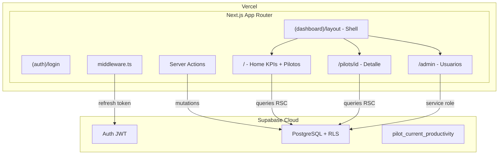

# Plan de Implementacion -- Dashboard de Pilotos IA Agentica

## Estado actual

El workspace ya tiene:
- Documentacion completa: [PRD](PRD.md), [Arquitectura](Arquitectura.md), [Casos de Uso](CasosDeUso.md), [Design System](DiseñoPantallas.md)
- Migration SQL lista: [migration.sql](../migration.sql) y [supabase/migrations/20260312120000_init.sql](../supabase/migrations/20260312120000_init.sql)
- Config Supabase minima: [supabase/config.toml](../supabase/config.toml)

No existe aun ningun codigo Next.js.

## Arquitectura objetivo



## Estructura de archivos a crear

Basada en la seccion 4 de [Arquitectura.md](Arquitectura.md):

```
src/
├── app/
│   ├── (auth)/
│   │   ├── login/page.tsx
│   │   └── layout.tsx
│   ├── (dashboard)/
│   │   ├── layout.tsx            # Shell: sidebar + topbar
│   │   ├── page.tsx              # Home / Pilotos (CU-01)
│   │   ├── pilots/[id]/page.tsx  # Detalle piloto (CU-02/03)
│   │   └── admin/page.tsx        # Gestion usuarios (CU-05)
│   ├── layout.tsx                # Root layout (providers, fonts)
│   └── globals.css
├── components/
│   ├── ui/                       # shadcn/ui: button, badge, input, select, dialog, table, skeleton, tooltip, dropdown-menu
│   ├── kpi-card.tsx
│   ├── pilots-table.tsx
│   ├── pilots-timeline.tsx       # Gantt ligero
│   ├── pilot-header.tsx
│   ├── impact-event-card.tsx
│   ├── impact-event-modal.tsx
│   ├── view-toggle.tsx
│   ├── sidebar.tsx
│   └── topbar.tsx
├── lib/
│   ├── supabase/
│   │   ├── client.ts             # createBrowserClient
│   │   ├── server.ts             # createServerClient (cookies)
│   │   ├── middleware.ts         # Refresh de sesion
│   │   └── admin.ts              # Service role (solo server, admin ops)
│   ├── types/
│   │   └── database.ts           # Tipos TypeScript manuales desde migration.sql
│   ├── queries/
│   │   ├── pilots.ts             # listPilots, getPilot
│   │   ├── impact-events.ts      # listImpactEvents
│   │   ├── kpis.ts               # getGlobalKPIs, getPilotKPIs
│   │   └── users.ts              # listUsers
│   ├── actions/
│   │   ├── pilot-actions.ts      # Server Actions: crear, editar piloto
│   │   ├── event-actions.ts      # Server Actions: crear, editar, borrar evento
│   │   └── user-actions.ts       # Server Actions: cambiar rol
│   ├── validations.ts            # Esquemas Zod para pilot e impact event
│   └── utils.ts                  # Helpers: cn(), formatDate(), colores por estado
├── hooks/
│   └── use-role.ts               # Context + hook para rol del usuario actual
├── middleware.ts                  # Proteccion de rutas + refresh sesion
└── .env.local.example            # Plantilla de variables de entorno
```

## Fases de implementacion

### Fase 1 -- Scaffolding y configuracion base

- Inicializar proyecto Next.js 14 con TypeScript, directorio `src/`
- Instalar dependencias (segun `Arquitectura.md` seccion 12):
  - **Produccion**: `next`, `react`, `react-dom`, `@supabase/supabase-js`, `@supabase/ssr`, `tailwindcss`, `zod`, `nuqs`, `date-fns`, `lucide-react`, `class-variance-authority`, `clsx`, `tailwind-merge`
  - **Dev**: `typescript`, `supabase` (CLI), `@types/react`, `@types/node`
- Configurar Tailwind con la paleta completa del Design System:
  - Neutros: `bg-page #F5F5F7`, `bg-surface #FFFFFF`, `border-subtle #E4E7EC`, `text-main #101828`, `text-secondary #667085`
  - Primarios: `primary #2563EB`, `primary-soft #EFF4FF`, `primary-border #D0E2FF`
  - Estados: planificado `#64748B`, en_marcha `#2563EB`, finalizado `#16A34A`, cancelado `#DC2626`
- Inicializar shadcn/ui y agregar componentes: `button`, `badge`, `input`, `select`, `dialog`, `table`, `skeleton`, `tooltip`, `dropdown-menu`
- Crear `.env.local.example` con las 3 variables: `NEXT_PUBLIC_SUPABASE_URL`, `NEXT_PUBLIC_SUPABASE_ANON_KEY`, `SUPABASE_SERVICE_ROLE_KEY`

### Fase 2 -- Capa Supabase (clientes + tipos + middleware)

- `src/lib/supabase/client.ts` -- `createBrowserClient` para componentes cliente
- `src/lib/supabase/server.ts` -- `createServerClient` con cookies para RSC y Server Actions
- `src/lib/supabase/middleware.ts` -- Refresh de sesion JWT en middleware
- `src/lib/supabase/admin.ts` -- Service role client (solo server, para cambio de roles)
- `src/lib/types/database.ts` -- Tipos TypeScript manuales basados en `migration.sql`:
  - 3 enums: `AppRole`, `PilotStatus`, `ImpactEventType`
  - 4 tablas: `Profile`, `UserRole`, `Pilot`, `ImpactEvent`
  - 1 vista: `PilotCurrentProductivity`
- `src/middleware.ts` -- Protege rutas `/(dashboard)`, redirect a `/login` si no autenticado. Cookies httpOnly, nunca localStorage

### Fase 3 -- Auth (login)

- `src/app/layout.tsx` -- Root layout: font Inter, globals.css, providers (role context)
- `src/app/(auth)/layout.tsx` -- Layout centrado (fondo `bg-page`, card centrada)
- `src/app/(auth)/login/page.tsx` -- Formulario email/password: `signInWithPassword()`, redirect a `/` tras login exitoso. Manejo de errores de credenciales

### Fase 4 -- Shell del dashboard

- `src/app/(dashboard)/layout.tsx` -- Shell: sidebar fijo (240px) + topbar (64px) + area de contenido (`bg-page`)
- `src/components/sidebar.tsx`:
  - Logo arriba
  - Item "Pilotos" (visible siempre)
  - Item "Administracion" (visible solo si `role === 'admin'`)
  - Estado activo: fondo `primary-soft`, texto e icono en `primary`
- `src/components/topbar.tsx`:
  - Izquierda: titulo de pagina (H1)
  - Derecha (en Home): filtros por estado, toggle vista Lista/Cronologica, boton "Anadir piloto" (solo Editor/Admin)
  - Derecha (global): email/nombre usuario + boton logout
- `src/hooks/use-role.ts` -- Context Provider cargado en root layout; hook `useRole()` para consumir el rol en componentes cliente
- `src/lib/utils.ts` -- `cn()`, `formatDate()`, `getStatusColor()`, `getStatusLabel()`

### Fase 5 -- Home / Pilotos (CU-01)

- `src/lib/queries/kpis.ts` -- `getGlobalKPIs()`:
  - Pilotos activos: `COUNT(*) WHERE status = 'en_marcha'`
  - Total personas formadas: `SUM(trained_people_count)` sobre todos los pilotos
  - Media % productividad: `AVG(productivity_improvement_pct)` desde la vista `pilot_current_productivity`
- `src/lib/queries/pilots.ts` -- `listPilots(filters)`:
  - Filtros: por `status` y por rango de fechas (start_date/end_date)
  - Orden por defecto: `en_marcha` primero, luego `start_date DESC`
- `src/components/kpi-card.tsx` -- Card segun Design System: label (12px, `text-secondary`), valor (24px, semibold, `text-main`), delta opcional (pill `primary-soft`)
- `src/components/pilots-table.tsx`:
  - Columnas: nombre+objetivo (2 lineas), estado (badge pill), fecha inicio, fecha fin, personas formadas (alineado derecha), % productividad (alineado derecha)
  - Fila clicable → navega a `/pilots/[id]`
  - Boton "Anadir piloto" visible solo Editor/Admin: crea piloto con estado `planificado` y redirige a detalle
- `src/components/pilots-timeline.tsx` -- Gantt ligero con CSS Grid:
  - Eje temporal horizontal (meses)
  - Barras coloreadas por estado (ver paleta en Fase 1), altura 16px, radio `999px`
  - Tooltip en hover: nombre, objetivo corto, personas formadas, % productividad (fondo `#1F2933`, texto blanco)
  - Clic en barra → navega a `/pilots/[id]`
  - Aplica los mismos filtros que la vista lista
- `src/components/view-toggle.tsx` -- Toggle pill Lista/Cronologica, persistido en URL con `nuqs` (`?view=list|timeline`). Recordado entre sesiones via URL
- `src/app/(dashboard)/page.tsx` -- Compone todo con `<Suspense>` y skeletons:
  ```tsx
  <Suspense fallback={<KPISkeletons />}><GlobalKPIs /></Suspense>
  <Suspense fallback={<TableSkeleton />}><PilotsView /></Suspense>
  ```

### Fase 6 -- Detalle de piloto (CU-02 / CU-03)

- `src/lib/queries/pilots.ts` -- `getPilot(id)`: datos del piloto
- `src/lib/queries/impact-events.ts` -- `listImpactEvents(pilotId)`: ordenados por `event_date DESC`, con paginacion inicial de 5 eventos ("Ver todos" para el resto)
- `src/lib/queries/kpis.ts` -- `getPilotKPIs(pilotId)`: `trained_people_count` (campo manual) + ultimo `productivity_improvement_pct` (ultimo evento de tipo `productividad`)
- `src/lib/actions/pilot-actions.ts` -- Server Actions con validacion Zod:
  - `createPilot()`: crea con estado `planificado`, redirige al detalle del piloto recien creado
  - `updatePilot(id, data)`: valida fecha_fin >= fecha_inicio; llama `revalidatePath`
- `src/lib/validations.ts` -- Esquemas Zod: `pilotSchema` (name obligatorio, dates validas), `impactEventSchema` (valor condicional segun tipo)
- `src/components/pilot-header.tsx`:
  - Lector: campos en modo lectura (nombre H1, objetivo subtitulo, badge estado, fechas, personas formadas)
  - Editor/Admin: campos editables inline + boton "Guardar" cuando hay cambios
- `src/components/impact-event-card.tsx` -- Tarjeta en mini-timeline vertical:
  - Linea vertical `#E4E7EC` + nodo circulo 8px `primary`
  - Fecha (12px, `text-secondary`), tipo badge, descripcion (14px), valor numerico semibold
  - Iconos editar/borrar visibles solo Editor/Admin (color `icon-muted`, hover `text-secondary`)
- `src/app/(dashboard)/pilots/[id]/page.tsx`:
  - Encabezado + 2 KPI cards + timeline de eventos (5 por defecto, "Ver todos")
  - Estado vacio: "Aun no hay eventos de impacto" + CTA "Anadir primer evento" (Editor/Admin)
  - Boton "Volver" que regresa al Home conservando el modo de vista (lista o cronologica) via URL params

### Fase 7 -- Eventos de impacto (CU-04)

- `src/lib/actions/event-actions.ts` -- Server Actions con validacion Zod:
  - `createImpactEvent(pilotId, data)`: valor condicional segun tipo (formacion: `trained_people_event`; productividad: `productivity_improvement_pct`; otro: ninguno)
  - `updateImpactEvent(id, data)`: actualiza y recalcula KPI de productividad si aplica
  - `deleteImpactEvent(id)`: borra con confirmacion; recalcula KPI de productividad si el evento borrado era el ultimo de tipo productividad
  - Todos llaman `revalidatePath` tras mutacion
- `src/components/impact-event-modal.tsx` -- Modal (shadcn Dialog, max-width 480px):
  - Select de tipo: Formacion / Productividad / Otro
  - Fecha del evento
  - Campo valor condicional: "Nº personas formadas" si Formacion, "% mejora productividad" si Productividad, oculto si Otro
  - Campo descripcion (texto corto, obligatorio)
  - Footer: boton primario "Guardar", boton ghost "Cancelar"
- Logica KPI al guardar (segun PRD seccion 3.4):
  - `trained_people_count` del piloto: NO se recalcula automaticamente desde eventos (es campo manual)
  - `productivity_improvement_pct` del piloto: se toma del ultimo evento de tipo productividad

### Fase 8 -- Administracion de usuarios (CU-05)

- `src/lib/queries/users.ts` -- `listUsers()`: join `profiles` + `user_roles`, solo ejecutable con service role (Admin)
- `src/lib/actions/user-actions.ts` -- Server Action `updateUserRole(userId, newRole)`:
  - Usa `admin.ts` (service role key, nunca expuesta al cliente)
  - Regla: no permitir que el sistema se quede sin ningun Admin
  - Llama `revalidatePath('/admin')`
- `src/app/(dashboard)/admin/page.tsx`:
  - Si el usuario no es Admin → redirect a `/`
  - Tabla de usuarios: email/nombre, rol actual (badge), dropdown para cambiar rol (Lector / Editor / Admin)
  - Solo visible en sidebar para Admin

### Fase 9 -- Pulido, estados vacios y optimistic updates

- Estados vacios (segun `DiseñoPantallas.md` seccion 7):
  - Home sin pilotos: icono outline, "Todavia no hay pilotos", boton "Crear primer piloto" (Editor/Admin)
  - Timeline sin eventos: "Aun no hay eventos de impacto para este piloto", boton "Anadir evento de impacto" (Editor/Admin)
  - KPIs con valor 0 o "N/D" cuando no hay datos suficientes
- `useOptimistic` de React para feedback inmediato en mutaciones (crear/editar/borrar eventos y pilotos), segun `Arquitectura.md` seccion 9
- Validaciones UX:
  - Nombre de piloto obligatorio (no puede estar en blanco)
  - Fecha fin >= fecha inicio (validacion Zod + mensaje de error en UI)
  - No se puede crear piloto con estado "finalizado" sin fecha fin (recomendado)
- Skeleton loaders para todas las secciones con `<Suspense>`:
  - `KPISkeletons`: 3 cards grises
  - `TableSkeleton`: filas grises
  - `TimelineSkeleton`: barras grises
- Responsive basico: sidebar colapsable en movil (overlay o hamburger menu)

## Decisiones tecnicas clave (de Arquitectura.md)

- **App Router** con RSC para queries directas en servidor, sin API intermedia
- **Server Actions** para todas las mutaciones (no Route Handlers -- ADR-03)
- **RLS** como segunda capa de seguridad en DB: aunque el frontend controle la UI, la DB rechaza operaciones no autorizadas
- **nuqs** para filtros y vista activa en URL: compartibles, compatibles con SSR, persisten en back/forward (ADR-05)
- **Gantt custom** con CSS Grid/Flexbox: sin librerias externas pesadas (ADR-04)
- **shadcn/ui** componentes copiados al proyecto, no dependencia externa (ADR-06)
- **Cookies httpOnly** para sesiones JWT: nunca localStorage
- **useOptimistic** para feedback inmediato en mutaciones
- Tipos TypeScript manuales inicialmente; se pueden regenerar con `supabase gen types typescript --local` cuando haya Supabase local

## Paleta de colores (de DiseñoPantallas.md)

| Token | Valor | Uso |
|-------|-------|-----|
| `bg-page` | `#F5F5F7` | Fondo general de la aplicacion |
| `bg-surface` | `#FFFFFF` | Cards, tabla, modal |
| `border-subtle` | `#E4E7EC` | Bordes de cards, filas, separadores |
| `text-main` | `#101828` | Titulos, valores KPI, nombre piloto |
| `text-secondary` | `#667085` | Labels, metadatos, fechas |
| `icon-muted` | `#98A2B3` | Iconos de accion en reposo |
| `primary` | `#2563EB` | Botones primarios, links, estado activo sidebar |
| `primary-soft` | `#EFF4FF` | Fondo estado activo sidebar, pill delta KPI |
| Planificado | `#64748B` | Badge y barra timeline |
| En marcha | `#2563EB` | Badge y barra timeline |
| Finalizado | `#16A34A` | Badge y barra timeline |
| Cancelado | `#DC2626` | Badge y barra timeline |
